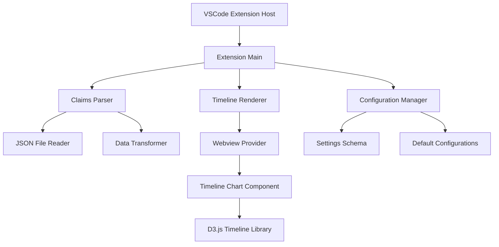

# Design Document

## Overview

The Medical Claims Timeline Viewer is a VSCode extension that provides interactive timeline visualization for healthcare claims data stored in JSON format. The extension will parse medical claims from configurable JSON attributes and render them as a chronological timeline with distinct visual representations for different claim types.

## Architecture

The extension follows VSCode's standard extension architecture with the following key components:



### Core Architecture Principles

1. **Separation of Concerns**: Parser, renderer, and configuration are separate modules
2. **Webview-based UI**: Timeline chart runs in a webview for rich interactivity
3. **Configurable Data Mapping**: Flexible attribute path configuration for different JSON structures
4. **Event-driven Communication**: Extension host communicates with webview via message passing

## Components and Interfaces

### 1. Extension Main (`extension.ts`)

**Purpose**: Entry point that registers commands and providers

**Key Responsibilities**:
- Register `viewMedicalTimeline` command
- Initialize webview provider
- Handle file detection and activation

**Interface**:
```typescript
interface ExtensionContext {
  activate(context: vscode.ExtensionContext): void;
  deactivate(): void;
}
```

### 2. Claims Parser (`claimsParser.ts`)

**Purpose**: Parse JSON files and extract timeline data

**Key Responsibilities**:
- Read and validate JSON structure
- Extract claims from configurable array paths
- Transform claims into standardized timeline format
- Handle date parsing and validation

**Interface**:
```typescript
interface ClaimsParser {
  parseFile(filePath: string): Promise<TimelineData>;
  validateStructure(json: any): boolean;
  extractClaims(json: any, config: ParserConfig): ClaimItem[];
}

interface ClaimItem {
  id: string;
  type: 'rxTba' | 'rxHistory' | 'medHistory';
  startDate: Date;
  endDate: Date;
  details: Record<string, any>;
  displayName: string;
}

interface TimelineData {
  claims: ClaimItem[];
  dateRange: { start: Date; end: Date };
  metadata: { totalClaims: number; claimTypes: string[] };
}
```

### 3. Timeline Renderer (`timelineRenderer.ts`)

**Purpose**: Manage webview and coordinate timeline display

**Key Responsibilities**:
- Create and manage webview panel
- Handle communication between extension and webview
- Coordinate data updates and user interactions

**Interface**:
```typescript
interface TimelineRenderer {
  createPanel(data: TimelineData): vscode.WebviewPanel;
  updateData(data: TimelineData): void;
  handleMessage(message: WebviewMessage): void;
}

interface WebviewMessage {
  command: 'zoom' | 'pan' | 'select' | 'configure';
  payload: any;
}
```

### 4. Configuration Manager (`configManager.ts`)

**Purpose**: Handle extension settings and user configuration

**Key Responsibilities**:
- Load and validate configuration settings
- Provide default attribute paths
- Handle configuration updates

**Interface**:
```typescript
interface ConfigManager {
  getParserConfig(): ParserConfig;
  updateConfig(updates: Partial<ParserConfig>): void;
  validateConfig(config: ParserConfig): boolean;
}

interface ParserConfig {
  rxTbaPath: string;
  rxHistoryPath: string;
  medHistoryPath: string;
  dateFormat: string;
  customMappings: Record<string, string>;
}
```

### 5. Timeline Chart Component (`webview/timeline.js`)

**Purpose**: Client-side timeline visualization using D3.js

**Key Responsibilities**:
- Render interactive timeline chart
- Handle zoom, pan, and selection interactions
- Display tooltips and detail panels
- Manage color coding and legends

## Data Models

### Timeline Data Structure

```typescript
interface TimelineData {
  claims: ClaimItem[];
  dateRange: {
    start: Date;
    end: Date;
  };
  metadata: {
    totalClaims: number;
    claimTypes: string[];
  };
}

interface ClaimItem {
  id: string;
  type: 'rxTba' | 'rxHistory' | 'medHistory';
  startDate: Date;
  endDate: Date;
  details: {
    // For rx claims
    dos?: string;
    dayssupply?: number;
    medication?: string;
    dosage?: string;
    
    // For medical claims
    srvcStart?: string;
    srvcEnd?: string;
    serviceType?: string;
    provider?: string;
    amount?: number;
    
    // Common fields
    [key: string]: any;
  };
  displayName: string;
  color: string;
}
```

### Configuration Schema

```json
{
  "medicalClaimsTimeline": {
    "rxTbaPath": "rxTba",
    "rxHistoryPath": "rxHistory", 
    "medHistoryPath": "medHistory",
    "dateFormat": "YYYY-MM-DD",
    "colors": {
      "rxTba": "#FF6B6B",
      "rxHistory": "#4ECDC4", 
      "medHistory": "#45B7D1"
    },
    "customMappings": {}
  }
}
```

## Error Handling

### File Processing Errors

1. **Invalid JSON**: Display user-friendly error with line number if possible
2. **Missing Required Fields**: Show specific missing attributes and suggested fixes
3. **Date Parsing Errors**: Highlight invalid date formats and provide examples
4. **Large File Handling**: Implement streaming for files over 10MB with progress indication

### Runtime Errors

1. **Webview Communication Failures**: Retry mechanism with fallback to simple text display
2. **Memory Issues**: Implement data pagination for large datasets
3. **Configuration Errors**: Validate settings and provide default fallbacks

### Error Recovery Strategies

```typescript
interface ErrorHandler {
  handleParsingError(error: ParseError): UserFriendlyError;
  handleRenderingError(error: RenderError): void;
  recoverFromError(error: Error): boolean;
}
```

## Testing Strategy

### Unit Testing

1. **Claims Parser Tests**:
   - Test JSON parsing with various structures
   - Validate date extraction and transformation
   - Test error handling for malformed data

2. **Configuration Manager Tests**:
   - Test setting validation and defaults
   - Test configuration updates and persistence

3. **Data Transformation Tests**:
   - Test claim item creation from different source formats
   - Validate timeline data structure generation

### Integration Testing

1. **Extension Activation Tests**:
   - Test command registration and activation
   - Test webview creation and communication

2. **End-to-End Workflow Tests**:
   - Test complete flow from file opening to timeline display
   - Test user interactions and data updates

### Sample Data Testing

1. **Realistic Data Sets**:
   - Test with sample files containing 100+ claims
   - Test edge cases like overlapping dates and missing fields
   - Performance testing with large datasets (1000+ claims)

### Webview Testing

1. **Timeline Rendering Tests**:
   - Test D3.js chart generation with various data sizes
   - Test zoom and pan functionality
   - Test responsive design across different screen sizes

2. **User Interaction Tests**:
   - Test tooltip display and accuracy
   - Test selection and detail panel functionality
   - Test legend and color coding accuracy